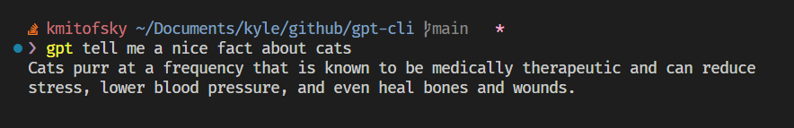
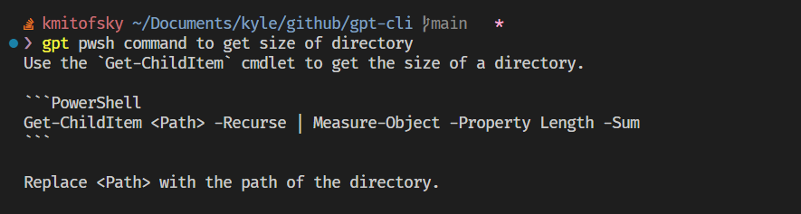

# GPT CLI

[](https://www.npmjs.com/package/gpt3-cli)


```bash
$ gpt write a haiku about winter
Cold winter night
Snowflakes falling from the sky
Peaceful serenity
```

## Install

```bash
npm i gpt3-cli -g
```

## Commands


```bash
# enter auth key
gpt auth

# customize config
gpt config

# ask question
gpt <your question here>
```

## Examples







## Notes

> **Note**
> Be careful with apostrophe's in your question, as they'll likely be interpreted to your shell as string delimiters


> **Note**
> You'll need to create and enter your own [API Key](https://beta.openai.com/account/api-keys)


## Logs

Logs are stored to a local `logs.json` file to help you debug info from the response that is not displayed on screen

## Todo

* [ ] Use conversation
* [ ] Timer for long responses or color spinner
* [ ] Other commands: `source`, `logs`, `error`
* [x] node fetch fallback (hopefully zero deps)

## Prior Art

* [ohall/gpt](https://github.com/ohall/gpt)
* [openai-node-cli](https://github.com/mirnes-cajlakovic/openai-node-cli)
* [assistant-cli](https://github.com/diciaup/assistant-cli)
* [openai-cli](https://www.npmjs.com/package/openai-cli)
* [ChatGPT-Agent](https://github.com/JacobLinCool/ChatGPT-Agent)
